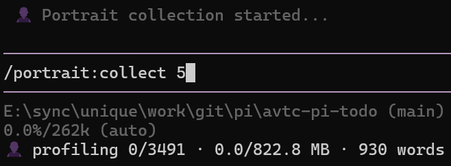

# avtc-pi-portrait

Builds a behavioral portrait from your session history — learns your corrections and injects them into the system prompt so the agent anticipates them before responding.

## Features

- **System-prompt injection** — learned rules are appended to the system prompt, so the agent anticipates your corrections before it responds
- **Learns from real corrections** — extracts lessons from agent → user → agent interaction trios, filtering out approvals and extension-generated noise so only genuine feedback shapes the portrait
- **LLM-curated ranking** — each candidate is ranked against your existing portrait (insert, merge, skip, or evict), keeping the most valuable rules on top
- **Automatic background dreaming** — runs on a timer (default off) to continuously learn from new sessions; enable via `/portrait:settings`
- **Maintenance** — automatically deduplicates, resolves contradictions, removes harmful rules, and promotes displaced rules back into freed slots as your portrait grows (also on demand via `/portrait:maintenance`)
- **Automatic + manual control** — run fully automatic, or drive it manually with `/portrait:collect`, `/portrait:stop`, `/portrait:pause`, `/portrait:resume`, and `/portrait:reset`
- **Live status widget** — real-time progress in the status bar (phase, trios processed, MB scanned, live token count)
- **Incremental scanning** — per-file checkpoints mean only new session data is processed each cycle
- **Cost control** — run dreaming on a cheaper model, with separate model overrides for extraction, post-extraction, and maintenance
- **Git-tracked history** — every portrait change is committed, giving you full auditability and easy recovery
- **Debug traceability** — opt-in dumps capture each extraction, maintenance, and backfill call's full input and streamed output, so you can trace unexpected rules back to their source interaction

A manual collect run with the live status widget showing progress:



## Installation

```bash
pi install npm:avtc-pi-portrait
```

## Starter Portrait (optional)

New installs start with an empty portrait and automatic collection disabled. Anticipation rules are extracted from your own sessions when you run `/portrait:collect`. To enable automatic background collection, open `/portrait:settings` and set `intervalMs` to a desired interval.

To get useful behavior from the start, you can seed a curated starter set of generic rules.

A ready-to-use sample lives in the repo at [`assets/portrait.sample.md`](./assets/portrait.sample.md):

```bash
# Copies only portrait.md — back up any existing portrait first
cp assets/portrait.sample.md ~/.pi/portrait/portrait.md
```

Notes:

- The sample is a **static starting point**. As you run collects and maintenance, the extension will rank, evolve, and replace these rules with ones learned from your own sessions.
- It's **not bundled** with the npm package — grab it from the [GitHub repo](https://github.com/avtc/avtc-pi-portrait/blob/master/assets/portrait.sample.md).
- Run `/reload` to pick up the copied portrait if pi is already running.

## Configuration

Configure portrait with the `/portrait:settings` command (an interactive editor). Settings are stored in `~/.pi/agent/avtc-pi-portrait-settings.json`, apply globally across all projects, and are read fresh on every cycle — so manual edits take effect immediately.

The full setting reference (types, defaults, descriptions, tab layout) lives in [`docs/CONFIGURATION.md`](./docs/CONFIGURATION.md).

## Storage

All data is stored in `~/.pi/portrait/`:

- `portrait.md` — Active anticipation rules (line position = rank, top = most valuable)
- `evicted.md` — Mechanically evicted rules (displaced by rule limit)
- `dropped.md` — Semantically dropped rules (removed by maintenance: duplicates, contradictions, harmful rules)
- `processed-sessions.json` — Scan checkpoints (tracks last processed line per session)
- `portrait-state.json` — Pause state, last pipeline run, trio counts, maintenance counters
- `.portrait-lock` — Cross-process lock file with heartbeat
- `debug/` — Extractor, maintenance, and backfill debug dumps (see "Debug" section below)

## Debug

Set `debugDumpLimit` to a positive number (e.g. `30`) to keep the most recent debug dumps under `~/.pi/portrait/debug/` (`0` = disabled, the default); older files are deleted automatically when the limit is exceeded. Each dump captures the full prompt and the LLM's response for one operation, so you can trace any rule back to the session interaction that produced it:

- `extraction-{timestamp}.txt` — one per extraction call (agent → user → agent trio → extracted rules)
- `maintenance-{timestamp}.txt` — one per maintenance run (dedup/contradiction/harmful-rule pass)
- `backfill-{timestamp}.txt` — one per maintenance backfill run (promoting evicted rules into freed slots)

## Commands

Portrait dreaming runs in two modes:

- **Automatic** — runs periodically on a timer (controlled by `intervalMs` in settings). Use `pause` / `resume` to toggle.
- **Manual** — one-shot trigger with `collect`. Use `stop` to cancel mid-run.

| Command | Description |
|---------|-------------|
| `/portrait:status` | Show current dreaming status (phase, timer, pause state) |
| `/portrait:settings` | Open the interactive settings editor (see [Configuration](./docs/CONFIGURATION.md)) |
| `/portrait:pause` | Pause automatic dreaming — stops the periodic timer. Manual `collect` runs are unaffected. (Lock holder only) |
| `/portrait:resume` | Resume automatic dreaming — restarts the timer and runs an immediate cycle. (Lock holder only) |
| `/portrait:collect [N]` | Run a one-shot manual collection. Optional `N` limits the number of session sequences to process. Runs in the background; use `/portrait:stop` to cancel. (Lock holder only) |
| `/portrait:stop` | Cancel a running manual `collect`. Does not affect the automatic timer. |
| `/portrait:maintenance` | Analyze and clean the portrait: remove duplicates, contradictions, and harmful rules, then promote evicted rules into freed slots. |
| `/portrait:reset` | Clear all portrait rules (portrait.md, evicted.md, dropped.md) and scan state. Preserves git history. Re-extracts from session history on next collect. (Lock holder only, requires confirmation) |

Cached portrait rules are refreshed from disk on `/reload`.

## How It Works

Portrait dreaming learns from **interaction trios** in your session history — an agent response, your correction or flag, and the agent's improved response. From each trio it extracts a short **behavioral principle**, ranks it against your existing portrait, and keeps the most valuable ones. The portrait is then appended to the system prompt on every agent turn, so the agent anticipates your corrections before it responds. Run `/portrait:maintenance` any time to deduplicate, resolve contradictions, generalize over-specific rules, and drop harmful ones.

> Developed with [Z.ai](https://z.ai/subscribe?ic=N5IV4LLOOV) — get 10% off your subscription via this referral link.

## License

MIT
